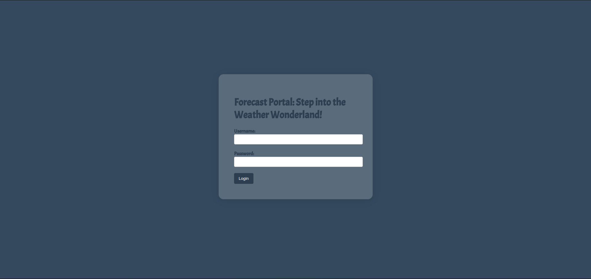
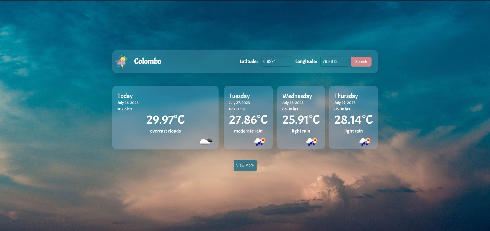
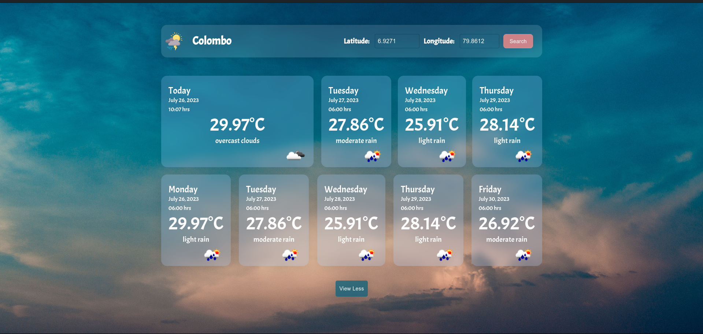

# Weather Forecast App

 

### This is a simple web based software to get weather details with the following basic features:

- can be searched from any longitude and latitude and get the weather details of a particular area.
- can be viewed the weather forecast for the next three days.
- can be viewed the weather forecast for the whole week (View More button)

 

## Technology Stack :

- Frontend - React JS
- Weather Details - https://openweathermap.org
- Deployement - AWS EC2 Instance
- Containerization - Docker
- Other - MUI Components

 

## Links :

- [Hosted Link](http://ec2-54-158-110-224.compute-1.amazonaws.com/login)

 

## Screenshots :

   
   
   
